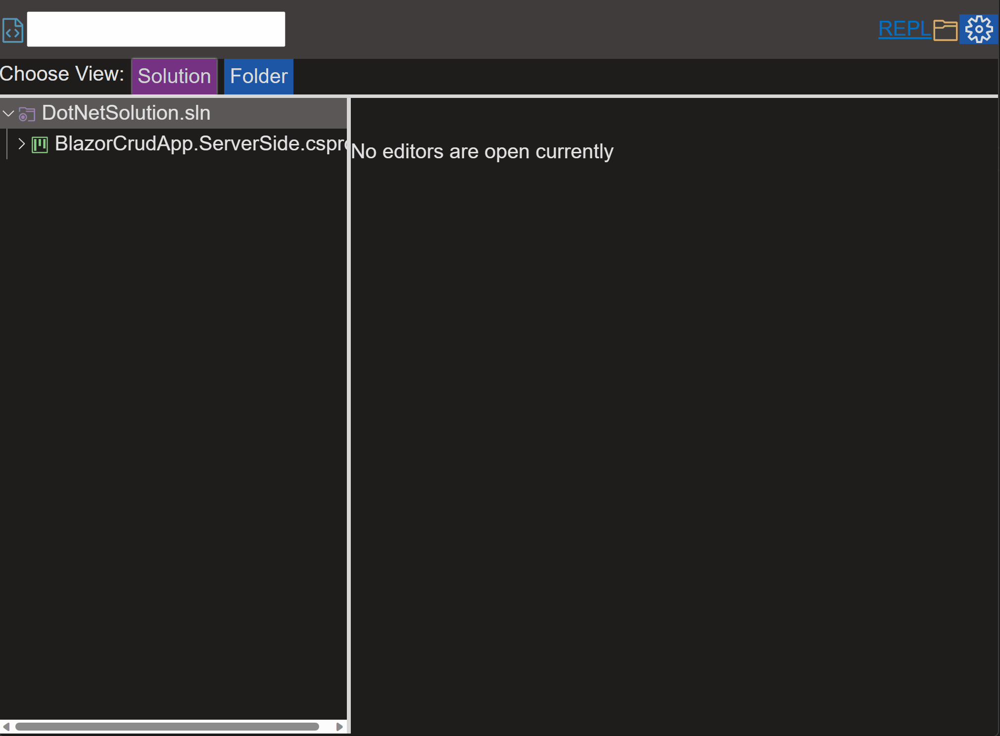
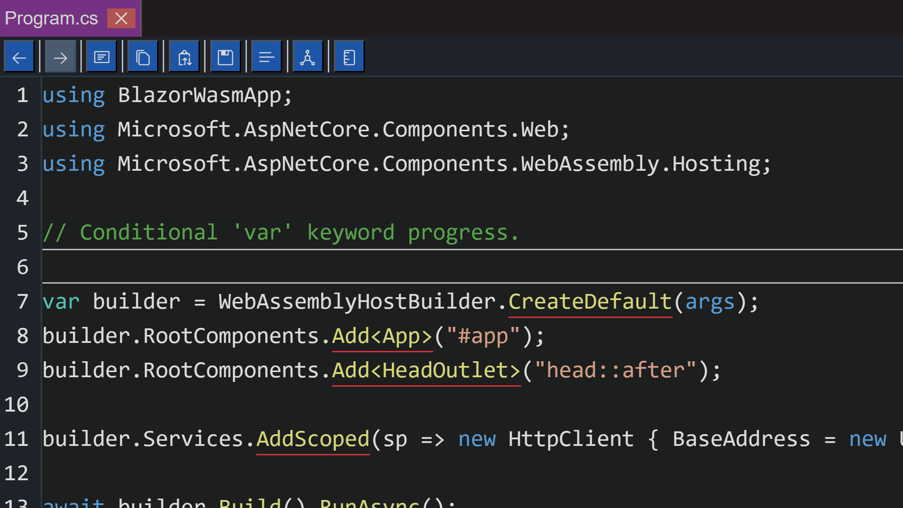

# Luthetus.Website

### One can gauge their interest in the repository with this one minute GIF:

## Demo:
https://luthetus.github.io/Luthetus.Website/

## Recent Changes:
(2023-05-30) 
- Parser improvements for "var contextual keyword"
- Parser improvements for "variable symbol identification"
- 
- BackgroundTaskQueueSingleThreaded was added for the WASM host. This fixes a lot that broke when going from ServerSide to a WASM host. An example being, creation of new files.